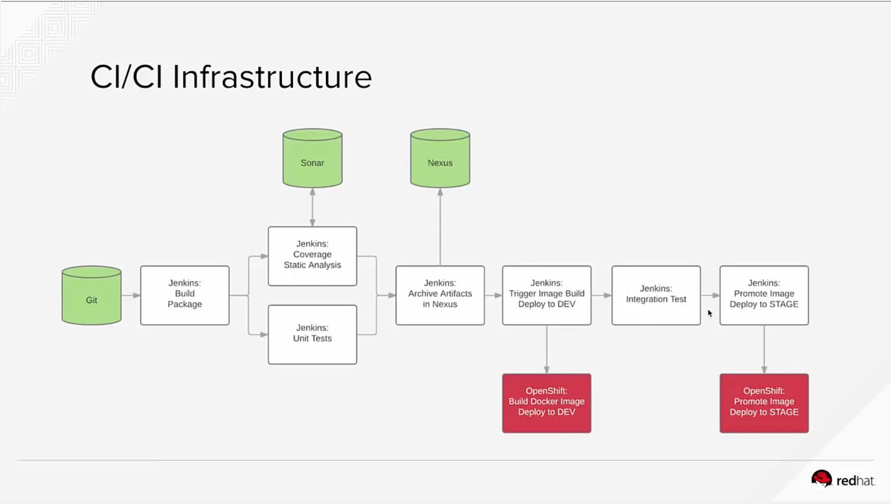

## CI/CD using Jenkins / sonarQube / Nexus

This will help you setup and run a CI/CD pipeline using:
- Jenkins
- SonarQube
- Nexus

Here is the schema of the process: 

Source: [OpenShiftDemos](https://github.com/OpenShiftDemos/openshift-cd-demo)

### Pre-requisites

- Create a "cicd" project in openshift using

    `oc new-project cicd --display-name="CI/CD"`

- Create the components based on the yaml file provided

    `oc process -f cicd-gogs-template.yaml | oc create -f -`

- Create the 2 projects for your app

    `oc new-project dev --display-name="Tasks - Dev"`
    `oc new-project stage --display-name="Tasks - Stage"`

- Give access to jenkins to your projects for tag / image push

    `oc policy add-role-to-user edit system:serviceaccount:cicd:default -n cicd`
    `oc policy add-role-to-user edit system:serviceaccount:cicd:default -n dev`
    `oc policy add-role-to-user edit system:serviceaccount:cicd:default -n stage`

